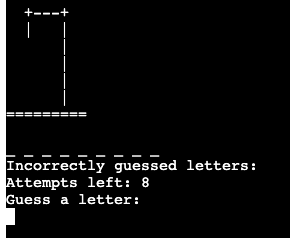

# **Hangman Challenge - Portfolio Project 3**

This is a Python terminal game of Hangman. The game allows users to guess letters of a word until they either guess the entire word correctly or run out of attempts. The number of attempts is determined by the difficulty level chosen by the user.

Live deployment Link - [Hangman Challenge](https://iberico-hangman-8ab91ba9c2a3.herokuapp.com/)

## How to play

Upon starting the game, users are prompted to enter their username. They are then greeted with a random greeting message and presented with a menu where they can choose to start the game, view the game rules, or exit the game.

When starting the game, users choose a difficulty level: Easy, Medium, or Hard. The difficulty level determines the number of attempts allowed and the length of the word to be guessed.

During the game, users are shown a series of underscores representing the letters of the word. They can guess one letter at a time. Correct guesses reveal the letter in the word, while incorrect guesses decrease the number of attempts left. The game provides feedback on incorrectly guessed letters and the number of attempts remaining.

The game ends when the user guesses the word correctly or runs out of attempts. After the game ends, users can choose to play again or return to the main menu.

## UX
### Site Purpose: 
To offer a digital rendition of the classic hangman game, allowing users to test their word-guessing skills against the computer.

### Audience:
Targeted at individuals who enjoy word games and are looking for a quick and engaging game to pass the time.

### Communication:
The game provides clear instructions and feedback to the user at every step, ensuring a smooth and intuitive gameplay experience.

### Current User Goals:
To enjoy a game of hangman, choosing from various difficulty levels, and aiming to guess the word before running out of attempts.

### Future Goals:
To introduce more features such as multiplayer mode, a hint system, and a wider variety of words.

## Flowchart
Before diving into the coding process, I created a flowchart to provide a clear roadmap for the program's implementation. This chart effectively outlines the program's structure, pinpointing areas for user input, system input validation, and the handling of any incorrect inputs.

## Features

### Existing Features

- **Welcome Message**
    - Upon starting the game, users are greeted with a welcome message and invited to provide their name as part of the initial setup.

    

- **Main Menu**
    - The game starts with a main menu that allows users to start the game, view the rules, or exit.  Worth mentioning, random selected welcome sentences with user's name from the following below options:
    1. Let's have some fun, {username}!
    2. Ready to guess, {username}?
    3. Can you beat the game, {username}?

    

- **Game Rules**
    - Presents the game rules for playing Hangman. Prompts user to press Enter to return to the main menu. 

    

- **Difficulty Selection**
    - To start the game, the user needs to choose from three difficulty levels: easy, medium, or hard. Each level has its own set of word lengths and allowed incorrect guesses.

    
    
- **Hangman Game**
    - User selects "Start Game".
    - Decide on a difficulty level:
        - **Easy** - word length: 3 characters and 5 guesses

        
        - **Medium** - word length between 4 and 6 characters and 6 guesses

        
        - **Hard** - word length higher than 7 characters and 8 guesses

        

    - Random Word Selection: The game selects a random word based on the chosen difficulty level.
    - Dynamic Feedback: The game provides feedback on **guessed letters**, **remaining attempts**, and **incorrectly guessed letters**.

    

- **Replayability** 
    - Once the game is over and the user has either won or lost, users are prompted to return to the main menu, where they can decide to replay or exit the game.

    **You won**

    

    **Game over**

    

- **Uninterrupted User Experience**
    - Throughout the program, a user is continuously kept within a loop to prevent program crashes or premature exits due to invalid inputs. For instance, if a user mistakenly enters a number instead of a letter during the guessing phase, they will receive an alert and be returned to the prompt to guess a letter or word, all without incurring a life loss in the game.

    

- **ASCII Art** 
    - The game uses ASCII art for welcome, game rules, win messages, and game over messages.

    

- **Favicon** 
    -  custom hangman favicon was integrated into the project for a personalized touch.
    
        
### Future Features
- Leaderboard: Implement a leaderboard to track and display top scores.
- Hints: Provide hints to users during the game.
- Multiplayer Mode: Allow multiple users to play against each other.
- Colors: Use a color scheme to distinguish specific areas of the text. 
- Categories: A wider variety of words and categories to choose from.

## Testing
### Validator Testing
- [CI PEP8 Online](https://pep8ci.herokuapp.com/). 
   - No errors were returned.

### Manual Testing
- Tested on my local terminal and the Code Institute Heroku terminal.
- Comprehensive testing was undertaken to guarantee seamless gameplay and robust handling of diverse user inputs. In cases of invalid inputs, the game provides a notification and requests the user to enter a valid command.

    **Invalid Username Input**

    

    **Invalid Main Menu Input**

    

    **Invalid Difficulty Input**

    

    **Invalid Letters Input**

    

## Bugs
### Solved Bugs
**Requirements.txt:** When I used the `pip3 freeze > requirements.txt` command, it generated the following list of dependencies:

However, when deploying to Heroku, I encountered the following error:

**Solution:** To resolve this issue, I had to manually edit the **requirements.txt** file and replace the section - **six @ file:///AppleInternal/BuildRoot/Library/Caches/com.apple.xbs/Sources/python3/python3-103/six-1.15.0-py2.py3-none-any.whl** with **six==1.15.0**. This adjustment ensured that the dependencies were correctly deployed to Heroku without errors.

### Remaining Bugs
- No remaining bugs

## **Technologies, Languages & Programs Used**

* [Python](https://www.w3schools.com/python/): Main Language - a high-level, general-purpose programming language.
* [GitHub](https://github.com/): Web-based platform for version control and collaboration on software projects.
* [Heroku](https://heroku.com/): a cloud platform as a service supporting several programming languages.
* [CI PEP8 Online](https://pep8ci.herokuapp.com/): CI Python Linter - Tool to check and enforce python coding standards.
* [CodeAnywhere](https://codeanywhere.com/): Cloud-based integrated development environment (IDE) for coding, collaborating, and deploying projects.
* [VSCode](https://code.visualstudio.com/): Free and highly extensible source code editor with built-in features for editing, debugging, and version control integration. It supports various programming languages and is available for multiple platforms.
* [ChatGPT](https://chat.openai.com/): Artificial intelligence chatbot.
* [Lucid](https://lucidchart.com): A web-based diagramming application that allows users to visually collaborate on drawing, revising and sharing charts and diagrams.
* [Techsini](http://techsini.com/multi-mockup/index.php): Mockup generator.
* [ASCII art](https://patorjk.com/software/taag/): a graphic design technique that uses computers for presentation and consists of pictures pieced together from the 95 printable characters.

## Imported Libraries and Packages
- [random](https://docs.python.org/3/library/random.html) was utilized to select a word at random from the `words.py` file.
- [os](https://docs.python.org/3/library/os.html) was employed to develop the `clear_screen` function, enhancing user experience by minimizing screen clutter.
- [time](https://docs.python.org/3/library/time.html) was incorporated to introduce a delay between repeated letter guesses, preventing the terminal from clearing immediately.

## Deployment

### Version Control
Version control was managed using Git within Visual Studio Code to update the main repository. Follow these steps:

1. Open the VS Code terminal and execute the command `git add .` to stage your changes and updates.

2. Use the command `git commit -m "Insert a short descriptive text"` to commit your changes and update the files.

3. Finally, employ the `git push` command to push your committed changes to the main repository.

### Page Deployment
The application was deployed using Heroku CLI. The deployment process is as follows:

1. After creating and logging into your Heroku account, navigate to the dashboard and click "New" to create a new app.

2. Choose a unique name for your app, select your desired region, and then click "Create app."

3. In the "Settings" section, find and click on "Config Vars."

4. Add the necessary Config Vars. For this app, only one is required: `KEY = PORT : VALUE = 8000`.

5. Set up the buildpacks in the following order: `Python` and `NodeJS`.

6. Click "Deploy" section.

7. Scroll down to the "Deployment Method" section and select "GitHub."

8. Choose the repository you want to deploy and connect it to Heroku.

9. For deployment options, for this project I chose "Manual deploy".

Live deployment link - [Hangman Challenge](https://iberico-hangman-8ab91ba9c2a3.herokuapp.com/)

## **Credits**
### **Code**
- Inspiration for the hangman game code:
    - Codefather [website](https://codefather.tech/blog/hangman-game-python/).
    - [youtube video](https://www.youtube.com/watch?v=cJJTnI22IF8).
    - [youtube video](https://www.youtube.com/watch?v=m4nEnsavl6w&t=3s).
- `if __name__ == ‘__main__’` - inspired by following [website](https://www.jcchouinard.com/python-if-name-equals-main/). 
- OS - inspired by this [website](https://www.youtube.com/watch?v=tJxcKyFMTGo).
- Random - inspired by this [website](https://www.youtube.com/watch?v=KzqSDvzOFNA).
- Time - information sourced from this [website](https://realpython.com/python-sleep/).

### **Content**
- I authored the entire content for the hangman game. Subsequently, with the assistance of ChatGPT, both the game content and the README file underwent meticulous refinement and corrections.
- Words.py - words were generated with chatGPT
- ASCII-art - generated with following [website](https://patorjk.com/software/taag/#p=display&f=Big&t=Welcome%20to%20%0AHANGMAN).

### **Media**
- The favicon was sourced from [freepik.com](https://www.freepik.com/) and formatted using [favicon converter](https://favicon.io/favicon-converter/).

## **Acknowledgements**
My heartfelt thanks to my mentor, Akshat Garg. His invaluable guidance and unwavering support were crucial to this project's success. I deeply appreciate his promptness and dedication throughout my journey.

